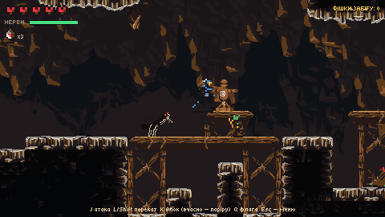

# ДОДЕП

Браузерна 2D-гра: темний піксельний **soulslike-рогалик + казино-слот**. Сатира на лудоманію: герой винен
підземному казино 25 000 фішок. Він спускається в печери фармити фішки, а босів «вибиває» на слот-машині:
3 скатери → бій з босом → 10 фріспінів. Вихід із казино відчиняється, коли борг погашено і переможено всіх босів.



**Стек:** Phaser 3 (Arcade Physics, `pixelArt: true`) · TypeScript (strict) · Vite · Vitest. Збереження — `localStorage`.
Статичний білд, без сервера.

**Грати:** https://raw.githack.com/Dimentor-afk/rogalic/claude/affectionate-einstein-t3fofs/docs/play/index.html —
зібрана гра лежить у репозиторії (`docs/play`, команда `npm run build:docs`), а безкоштовний CDN raw.githack.com
віддає її прямо з публічного репозиторію, без жодних налаштувань.

Ще один варіант — GitHub Pages (https://dimentor-afk.github.io/rogalic/): workflow `.github/workflows/deploy.yml`
збирає і публікує гру з основної гілки, щойно в налаштуваннях увімкнено *Settings → Pages → Source: GitHub Actions*.
Поки Pages вимкнено, публікація пропускається, а перевірки (типи, тести, симуляція RTP, збірка) працюють.

---

## Зміст

- [Запуск](#запуск) · [Керування](#керування) · [Ігровий цикл](#ігровий-цикл)
- [Структура коду](#структура-коду) · [Як додати ворога, боса, символ](#як-додати-ворога-боса-символ)
- Алгоритми: [генерація підземелля](#1-генерація-підземелля) · [автотайлінг](#2-автотайлінг-і-рівень) ·
  [бій](#3-бій) · [AI ворогів](#4-ai-ворогів) · [боси](#5-боси) · [слот і RTP](#6-слот) · [гарант](#7-шкала-гаранту) ·
  [економіка](#8-економіка) · [пакування спрайтів](#9-пакування-спрайтів-і-asset-manifest)
- [Перевірка вимог ТЗ](#перевірка-вимог-тз) · [Асети і ліцензії](#асети-і-ліцензії)

## Запуск

```bash
npm ci
npm run dev        # http://localhost:5173  (?seed=123 — фіксоване підземелля)
npm test           # 153 юніт-тести (Vitest)
npm run sim        # симуляція слота: 1 000 000 спінів → RTP, частота бонусок, розподіл виграшів
npm run build      # перевірка типів + статичний білд у dist/
npm run build:docs # той самий білд у docs/play — онлайн-версія з репозиторію (оновлювати після змін)
npm run pack       # перепакувати спрайти з assets-src/ (потрібні сирі паки, див. assets-src/README.md)
```

Запаковані атласи вже лежать у `public/assets/`, тож для запуску гри сирі паки не потрібні.

## Керування

| Дія | Клавіатура | Геймпад |
|---|---|---|
| Рух | A/D або ←/→ | D-pad / лівий стік |
| Стрибок (тримати — вище) | Space або Z | A |
| Зістрибнути з дерев'яної платформи | S/↓ + стрибок | вниз + A |
| Атака | J або X | X / RT |
| Перекат (i-frames) | L, Shift або C | B |
| Блок (натиснути вчасно — паріру) | K або V | LB / LT |
| Фляга «Енергетик» | Q або B | Y |
| Взаємодія | E, W/↑ | RB |
| Пауза / назад | Esc | — |

**Слот:** Space — крутити, A/D — ставка, B — купити бонус, T — автоспін, M — звук, Esc — до хабу.
**Дебаг:** H — хітбокси й зони ударів; у тренуванні G — галерея асетів, 1–4 — зброя, T — броня.
Розкладка — `src/config/input.ts`.

## Ігровий цикл

```
           ┌────────────── хаб (печерне казино) ──────────────┐
           │  каса (борг)  коваль (прокачка)  кіт-швейцар     │
           │  дошка рекордів  трофеї босів  ВИХІД (фінал)     │
           └───┬───────────────────────────────▲──────────┬───┘
     спуск     │                               │ ліфт:     │ автомат
               ▼                               │ фішки →   ▼
   підземелля (поверх за seed) ── глибше ──▶ … │ баланс  слот 5×3, 20 ліній
   вороги, бочки, скриня, мішок смерті         │ +відсотки │ 3 скатери / «купити бонус»
               │ смерть: фішки → «мішок»       │ на борг   ▼
               └───────────────────────────────┘        арена боса ── програв → «бонуска згоріла»
                                                            │ переміг
                                                            ▼
                                       10 фріспінів (стартовий множник за бій) → баланс
```

- **Фішки** — єдина валюта. **Борг** росте на 1,5% після кожного повернення з підземелля.
- **Смерть**: фішки забігу лишаються «мішком» на глибині смерті; забрав наступного разу — повернув,
  помер знову — старий мішок згорає.
- **Прокляття** (3 символи на слоті) — модифікатор наступного спуску: темрява, удвічі більше ворогів,
  без фляг, швидші вороги, мінус серце; за кожне — ×1,4–1,7 фішок.
- **Боси**: 6 звичайних + фінальний «КАЗИНО», скатер якого з'являється лише після перемоги над усіма іншими.
  Великі істоти — боси (Голем-Гарант, Демон-Крупʼє, Смерть-Колектор — велетенський череп, королі з паку);
  дрібнота — звичайні вороги.

## Структура коду

```
src/
  config/        ВЕСЬ контент і баланс: вороги, боси, символи слота, ваги, ціни, борг, зброя, прокляття,
                 маніфест асетів, тайлсет, керування, тексти. Логіка про конкретних ворогів/босів не знає.
  core/          «рушій» без прив'язки до контенту (більшість — без Phaser, тестується у Node)
    dungeon/     генератор підземелля, перевірка досяжності
    level/       ASCII → сітка, автотайлінг, рендер рівня, лінія видимості
    combat/      стаміна, геометрія ударів, захист (блок/паріру/ухилення), бойова система сцени
    slot/        логіка слота (спін, лінії, гарант, фріспіни) і застосування до стану гри
    state/       збереження і всі операції з економікою (чисті функції)
    assets/      маніфест, анімації, заглушки кодом   audio/  синтезовані звуки WebAudio   fx/  ефекти
  entities/      Player, Enemy + компоненти поведінки, Boss + бібліотека патернів, снаряди, пропси
  scenes/        Boot → Preload → меню → хаб / підземелля / слот / арена боса / фріспіни / фінал; HUD
  levels/        шаблони кімнат, хаб, арени (ASCII-JSON)
  ui/            текст, меню, барабани слота
tools/           пакувальник спрайтів, симуляція RTP
tests/           Vitest: генератор, бій, економіка, слот, маніфест, конфіг босів, пакувальник
```

## Як додати ворога, боса, символ

Код змінювати не треба — лише спрайти й конфіг (це перевіряють тести `tests/manifest.test.ts` і `tests/bosses.test.ts`).

1. **Спрайти:** покласти пак у `assets-src/`, описати джерело в `tools/pack.config.json`, `npm run pack`,
   додати запис у `src/config/assets.ts` (атлас, хітбокс, префікси анімацій). Перевірити в галереї асетів.
   Відсутні анімації замінюються fallback-ефектами кодом (див. нижче).
2. **Ворог:** запис у `src/config/enemies.ts` — спрайт, HP, шкода, швидкість, нагорода, **архетип**
   (`fast` · `heavy` · `ranged` · `splitter` · `thief`), з якої глибини з'являється і з якою вагою.
3. **Бос:** запис у `src/config/bosses.ts` — спрайт, HP, арена (`src/levels/arenas.json`), фази (поріг HP →
   набір атак з бібліотеки з параметрами), тип фріспінів (ваги множників), цільовий час; `BOSS_ORDER`.
   Скатер боса з'являється на барабанах автоматично.
4. **Символ слота:** запис у `SYMBOLS` (`src/config/slot.ts`) — тип, вага, виплати. Поки спрайта немає,
   малюється заглушка того ж розміру (40×40); спрайт підхоплюється з атласу `slot` (кадр `slot/<id>`,
   для скатера боса `slot/sc_<id боса>`).
5. Після зміни ваг/виплат — `npm run sim` (має бути «RTP у цільовому діапазоні ✔»).

---

## Алгоритми

### 1. Генерація підземелля

`src/core/dungeon/generator.ts`, підхід Dead Cells: шаблони кімнат зроблені вручну, компонування — процедурне.

1. **Граф рівня.** Головний шлях `старт → N бойових → вихід (ліфт)`, де N = 3 + (глибина − 1), максимум 7.
   До випадкових бойових кімнат чіпляються відгалуження: скарбниця (з 3-ї глибини — дві) і, з шансом 50%,
   додаткова бойова кімната.
2. **Укладання на макросітку 7×5** (одна кімната = одна клітинка) — пошук у глибину з відкатом (backtracking).
   Кожен наступний вузол ставимо в сусідню вільну клітинку батька; напрямки перемішуються з вагами
   (вбік частіше, ніж вгору/вниз). Глухий кут — відкат і інший напрямок.
3. **Вибір шаблону.** Потрібні виходи кімнати = напрямки до сусідів по графу. Підходить шаблон потрібного типу,
   чиї виходи ⊇ потрібних; кожен шаблон має і дзеркальну копію (L↔R), що подвоює різноманіття.
   Зайві виходи замуровуються (`L R U D` → скеля, разом з «умовною скелею» `l r u d` навколо них).
4. **Зшивання.** Усі шаблони 30×17 з однаковими позиціями отворів, сусідні кімнати ділять стіну —
   отвори завжди збігаються.
5. **Заселення.** Слоти ворогів (`e` — наземний, `f` — літун) заповнюються з імовірністю 55% + 8%/глибину;
   ворог обирається за вагами серед доступних на цій глибині. Бочки, скриня (фішки, 50% — фляга), ліфт,
   двері глибше, мішок смерті (якщо він на цій глибині). Прокляття «гурт» подвоює ворогів.
6. **Валідація.** Пошук у ширину по станах «де гравець може стояти» з моделлю руху (висота стрибка, ширина
   стрибка, падіння, дошки) — ліфт, спуск і скарбниці мусять бути досяжні зі старту. Не вийшло — нова спроба
   з тим самим RNG.

**Відтворюваність:** seed поверху = `hash32(seed забігу, глибина)`, увесь випадок — з `mulberry32(seed)`.
Той самий seed → те саме підземелля (тест генерує ~600 рівнів і перевіряє досяжність та детермінізм).

### 2. Автотайлінг і рівень

- **4-бітна маска сусідів** (`src/core/level/autotile.ts`): для твердої клітинки відкрита сторона дає біт
  T=1, R=2, B=4, L=8; маска 0…15 обирає шматок тайлсету. Ліві стіни — дзеркальні копії правих. Немає шматка
  для маски — береться підмаска з найбільшою кількістю спільних сторін. Варіант шматка — `hash32(seed, x, y)`.
- **Затемнення вглиб скелі** — багатоджерельний BFS від порожніх клітинок, яскравість за відстанню.
- **Дошки** (односторонні платформи) — колізія лише з верхньою гранню і лише якщо на попередньому кроці
  ноги були вище дошки; вниз+стрибок — зістрибнути. Під довгими дошками автоматично ставиться риштування.
- **Лінія видимості** ворогів — DDA-обхід клітинок сітки між двома точками (`src/core/level/los.ts`).

### 3. Бій

- **Стаміна «Нерви»** (`src/core/combat/stamina.ts`) — правило souls: дію можна почати, поки стаміна > 0,
  навіть якщо її не вистачає на всю дію (тоді вона просто обнуляється); відновлення — після паузи.
- **Удар гравця** — сектор (радіус + кут) перед героєм проти прямокутника цілі (найближча точка
  прямокутника до центру сектора). Фази зброї: замах → активна → відновлення; кожен замах б'є ціль один раз.
- **Захист** (`src/core/combat/defense.ts`, чиста функція): i-frames переката → ухилення; блок натиснуто
  менш як за **150 мс** до удару → **паріру** (нападник оглушений, наступний удар по ньому критичний ×2,5,
  снаряд відбивається назад); блок тримається → шкода в стаміну; стаміни не вистачило → пробиття блоку.
- **Відчуття удару:** червоне блимання, відкидання, hitstop (заморожування логіки на 55–160 мс), тряска.
- **Буфер дій** 200 мс: натиснув атаку під час удару чи перекату — виконається, щойно можна.

### 4. AI ворогів

Компонентно (`src/entities/enemies/components.ts`): архетип = набір переюзабельних модулів, різниця між
«швидким слабким» і «повільним важким» — лише в числах конфігу.

| Архетип | Модулі | Хто |
|---|---|---|
| `fast` — часто б'є, короткий телеграф | `meleeBrain` | гоблін, павуки, кровосос |
| `heavy` — сильний удар, довгий телеграф, «гіпер-броня» на замаху | `meleeBrain` | скелети |
| `ranged` — тримає дистанцію, стріляє | `rangedBrain` | гоблін-пращник (кидає фішки) |
| `splitter` — ділиться при смерті | `meleeBrain` + `splitOnDeath` | слиз → 2 мікрокредити |
| `thief` — краде 25% фішок забігу і тікає; вбив — повернув | `meleeBrain` + `thief` | біс-кишеньковий |

`meleeBrain`: патруль → помітив (радіус + лінія видимості) → переслідування з перевіркою «попереду є підлога» →
**телеграф** (зупинка + біле блимання + тремтіння) → ривок/удар → відновлення → кулдаун.
Скейлінг від глибини: HP +22%, шкода +12%, кількість +20%, фішки +35% за кожен поверх (`DEPTH_SCALING`).

### 5. Боси

- **Бібліотека патернів** (`src/entities/boss/patterns.ts`): ближній удар, ривок (у літуна — пікірування на
  точку, показану лінією), постріл, віяло, дощ з неба, перешкоди (тверді стовпи або шкідливі шипи/калюжі),
  виклик міньйонів, ріст, удар об землю з ударними хвилями, телепорт. Кожен патерн:
  **телеграф** (чесна підказка, куди прилетить: зони, лінії, мітки) → дія → відновлення.
- **Фази**: поріг частки HP → новий набір атак, швидкість, пауза між атаками, вигук.
  Атака в фазі обирається випадково за вагами.
- **Фінальний бос «КАЗИНО» підкручує атаки** (`RiggedPattern`): у 45% атак показує телеграф однієї атаки,
  а за 340 мс до удару перемикається на іншу — з власним коротким, але чесним телеграфом («ПІДКРУТКА!»).
- **Множник фріспінів за бій** (значення — у конфігу): без отриманої шкоди ×5, без фляг +×2,
  швидше за цільовий час +×2; нічого — ×1.

### 6. Слот

`src/core/slot/slot.ts` — чисті функції, результат рахується **до** анімації.

- **Сітка 5×3, 20 ліній** (конфіг). Кожна клітинка — незалежний зважений вибір символу: бінарний пошук
  по префіксних сумах ваг. RNG — `mulberry32`, стан зберігається в сейві → спіни відтворювані.
- **Оцінка лінії:** зліва направо; рахуємо два варіанти — «лише wild-и» і «перший не-wild символ + wild-и»
  (wild замінює низькі/середні/високі, але не скатер і не прокляття), береться вигідніший.
  Виплата в «ставках на лінію» → фішки: `floor(units · ставка / 20 · множник)`.
- **Скатери**: у кожного боса свій; загальна вага скатерів ділиться між доступними босами. 3+ будь-де → бонуска,
  бос — той, чиїх скатерів найбільше (нічия — випадково серед лідерів). 3+ «прокляття» → прокляття спуску.
- **Near-miss**: якщо після якогось барабана вже видно 2 скатери, решта крутиться довше, рамка блимає.
- **Фріспіни**: таблиця без скатерів і прокляття, з символами-множниками x2/x5/x10/x25 (ваги — тип фріспінів боса:
  «часті дрібні», «рідкі великі», «все або нічого»…). Множники додаються до загального множника серії,
  і **усі** виграші серії множаться на нього наприкінці.
- **Симуляція RTP** (`tools/simulate-slot.ts`): 1 000 000 спінів зі ставкою 10; бонуска розігрується через
  модель гравця (шанс перемоги над босом 70%, шанси без шкоди / без фляг / швидко). Бо рідкісні великі бонуски
  дають великий розкид, RTP оцінюється з розкладом: `RTP = RTP основної гри + частота бонуски × середній виграш
  бонуски`, де середній виграш оцінюється окремо на 100 000 бонусок. CI запускає симуляцію з фіксованим seed.

```
Спінів: 1 000 000  ставка 10  seed 42
RTP (оцінка з розкладом): 95.34%   ціль 94.00%–96.00%
  основна гра:            60.15%
  бонуски:                35.19%  (98.2 ставок × 1/279 спінів)
Частота виграшу:      34.35%
Бонуска:              1 на 279 спінів (природних 1/523, гарантованих 1669)
Прокляття:            1 на 275 спінів
Розподіл виграшів (у ставках):
  без виграшу 65.65% · <1x 18.95% · 1–2x 7.39% · 2–5x 5.61% · 5–10x 1.66% · 10–20x 0.45% · 20–100x 0.18% · 100x+ 0.12%
```

Більше половини «виграшів» менші за ставку — і все одно зустрічаються звуком і написом «ВИГРАШ!». Так задумано.

### 7. Шкала гаранту

Кожен скатер у спіні без бонуски додає 1%. На 100% наступний спін гарантує бонуску: якщо вона не випала
природно, три скатери одного випадкового доступного боса ставляться на три різні барабани (чужі скатери
прибираються, щоб не було нічиїх). Після бонуски шкала обнуляється. Гарант уже врахований у RTP:
приблизно кожна шоста бонуска — гарантована (природна — 1 на 523 спіни, разом з гарантом — 1 на 279).

### 8. Економіка

`src/core/state/GameState.ts` — чисті функції над `SaveData` (тести в `tests/economy.test.ts`):
`startRun` (seed спуску з лічильника, прокляття «з'їдається») → `finishRun` (ліфт: фішки на баланс; смерть:
мішок, старий згорає; відсотки на борг ⌈1,5%⌉, мінімум 50; «днів без додепу») → каса `payDebt` будь-якою сумою →
коваль `buyUpgrade`/`buyWeapon` (броня видна на спрайті, +фляга, +стаміна, +серце, нова зброя).
Вихід відчиняється, коли `debt = 0` і всі боси в колекції (`canExit`).

### 9. Пакування спрайтів і asset manifest

- `tools/pack-sprites.ts`: джерела `frames` (PNG на кадр, регулярка імені), `strip` (стрічка кадрів), `cells`
  (шматки тайлсету) → масштаб найближчим сусідом (з перевіркою, що арт складається з однотонних блоків) →
  обрізання прозорих країв (trim) → **shelf packing** (кадри за висотою, «полицями» зліва направо) → атлас
  PNG + JSON Hash для Phaser; тайлам — extrude від щілин.
- **Маніфест** (`src/config/assets.ts`): логічний спрайт → атлас, хітбокс, анімації за префіксами кадрів.
  Код знає лише «idle/walk/attack/…».
- **Fallback-ефекти кодом**, коли анімації немає: телеграф атаки — зупинка + біле блимання + тремтіння → ривок;
  перекат — ривок + післяобрази + напівпрозорість; удар — червоне блимання + відкидання + hitstop;
  смерть без анімації — розсипання на частинки за пікселями спрайта. Слот-машина, символи й кнопки слота —
  заглушки кодом того ж розміру, що й майбутні спрайти: заміна — просто файлом.

---

## Перевірка вимог ТЗ

| Критерій | Як перевірено |
|---|---|
| Запускається в браузері, 60 FPS | Phaser + Vite, статичний білд; рівень малюється одним Blitter, без фізики на кожен тайл |
| Кожен спуск — інше підземелля, той самий seed — те саме | `tests/dungeon.test.ts`; `?seed=123` в адресі |
| Новий ворог / бос / символ — лише спрайти + конфіг | `tests/manifest.test.ts`, `tests/bosses.test.ts`; розділ вище |
| RTP симуляції в цільовому діапазоні | `npm run sim` → 95,3% (ціль 94–96%), перевіряється в CI |
| Гру можна пройти від старту до виходу | наскрізний сценарій у браузері: боси → каса → вихід → фінальний екран |
| README з алгоритмами, GIF, списком асетів | цей файл |

## Асети і ліцензії

Навчальний некомерційний проєкт. Сирі паки в репозиторій не входять (`assets-src/` у `.gitignore`) —
ліцензії забороняють поширювати їх окремо від гри; у репозиторії лише запаковані атласи як частина гри.

| Пак | Що використовуємо | Автор / ліцензія (з файлів паку) |
|---|---|---|
| Roguelike Dungeon – Asset Bundle | гравець (4 зброї × 5 рівнів броні), гобліни, скелети, слизи, 4 боси-королі та їхні снаряди, HUD, предмети, бочки, двері | файлу ліцензії в паку немає |
| PixelFantasy Caves 1.0 | скеля, дошки, риштування, сталактити, фони | файлу ліцензії в паку немає |
| Golems Free Version | бос Голем-Гарант | файлу ліцензії в паку немає |
| Flying Demon 2D Pixel Art | бос Демон-Крупʼє, вогняна куля | безкоштовно в ігрових проєктах, без перепродажу/поширення як асету |
| DuskBorne ArchDemon | фінальний бос «КАЗИНО» | файлу ліцензії в паку немає |
| Tiny RPG Character Asset Pack 02 (Demon_A, Blood Monster_A) | біс-злодій, кровосос | файлу ліцензії в паку немає |
| The Forest Giant Spider v2 | павуки | pidroudays (itch.io); вільно в проєктах, без поширення окремо |
| FREE Cat 2D Pixel Art | кіт-швейцар у хабі | безкоштовно в ігрових проєктах, без поширення як асету |
| FREE Blacksmith 2D Pixel Art | коваль у хабі | безкоштовно в ігрових проєктах, без поширення як асету |
| Training Dummy 2D Pixel Art | манекен на полігоні | безкоштовно в ігрових проєктах, без поширення як асету |
| Super Pixel Effects Gigapack (Free) v2.9.0 | іскри ударів, паріру, дим, монети, вибухи, лікування | Will Tice / unTied Games; лише у складі гри, з атрибуцією |
| Pixel Magic Effects | шипи з-під землі, каміння, портал, вогняна куля | lordfitoi / Foozle, CC0 |
| Шрифт Tiny5 (`@fontsource/tiny5`) | увесь текст, з кирилицею | The Tiny5 Project Authors, SIL OFL 1.1 |
| Phaser 3 | рушій | Phaser Studio, MIT |

Звуки синтезуються кодом через WebAudio (`src/core/audio/Sfx.ts`) — файлів звуку немає.
